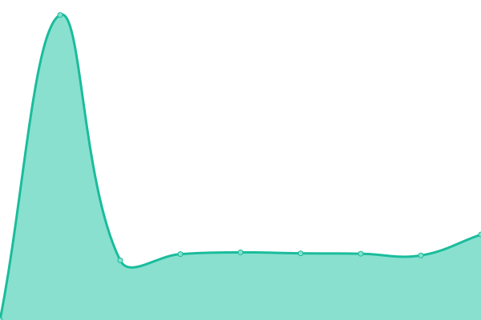

# [📈 Live Status](https://status.depositar.io): <!--live status--> **🟩 All systems operational**

This repository contains the open-source uptime monitor and status page for [depositar](https://data.depositar.io), powered by [Upptime](https://github.com/upptime/upptime).

With [Upptime](https://upptime.js.org), you can get your own unlimited and free uptime monitor and status page, powered entirely by a GitHub repository. We use [Issues](https://github.com/depositar/status/issues) as incident reports, [Actions](https://github.com/depositar/status/actions) as uptime monitors, and [Pages](https://status.depositar.io) for the status page.

<!--start: status pages-->
<!-- This summary is generated by Upptime (https://github.com/upptime/upptime) -->
<!-- Do not edit this manually, your changes will be overwritten -->
<!-- prettier-ignore -->
| URL | Status | History | Response Time | Uptime |
| --- | ------ | ------- | ------------- | ------ |
|  [depositar](https://data.depositar.io/) | 🟩 Up | [depositar.yml](https://github.com/depositar/status/commits/HEAD/history/depositar.yml) | 

 4732ms
     
 | 

<a href="https://status.depositar.io/history/depositar">98.16%</a>
    

|  [depositar-demo](https://demo.depositar.io/) | 🟩 Up | [depositar-demo.yml](https://github.com/depositar/status/commits/HEAD/history/depositar-demo.yml) | 

 1082ms
     
 | 

<a href="https://status.depositar.io/history/depositar-demo">99.54%</a>
    

|  [depositar-binder](https://binder.depositar.io/) | 🟩 Up | [depositar-binder.yml](https://github.com/depositar/status/commits/HEAD/history/depositar-binder.yml) | 

 858ms
     
 | 

<a href="https://status.depositar.io/history/depositar-binder">100.00%</a>
    

|  [rdm-hub](https://rdm.depositar.io/) | 🟩 Up | [rdm-hub.yml](https://github.com/depositar/status/commits/HEAD/history/rdm-hub.yml) | 

 541ms
     
 | 

<a href="https://status.depositar.io/history/rdm-hub">100.00%</a>
    

<!--end: status pages-->

[**Visit our status website →**](https://status.depositar.io)

## 📄 License

- Powered by: [Upptime](https://github.com/upptime/upptime)
- Code: [MIT](./LICENSE) © [The depositar team](https://data.depositar.io)
- Data in the `./history` directory: [Open Database License](https://opendatacommons.org/licenses/odbl/1-0/)
